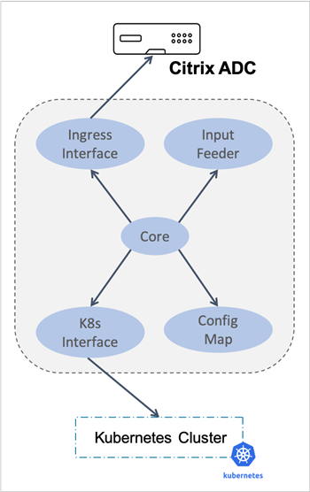

---

# Citrix k8s node controller

Citrix k8s node controller is a micro service provided by Citrix that creates network between the Kubernetes cluster and ingress device.

## Contents

  + [Overview](#overview)
  + [Architecture](#architecture)
  + [How it works](#how-it-works)
  + [Get started](#get-started)
    + [Using Citrix k8s node controller as a process](#using-citrix-k8s-node-controller-as-a-process)
    + [Using Citrix k8s node controller as a microservice](#using-citrix-k8s-node-controller-as-a-microservice)
  + [Questions](#questions)
  + [Issues](#issues)
  + [Code of conduct](#code-of-conduct)
  + [License](#license)

## Overview

In Kubernetes environments, when you expose the services for external access through the Ingress device, to route the traffic into the cluster, you need to appropriately configure the network between the Kubernetes nodes and the Ingress device. Configuring the network is challenging as the pods use private IP addresses based on the CNI framework. Without proper network configuration, the Ingress device cannot access these private IP addresses. Also, manually configuring the network to ensure such reachability is cumbersome in Kubernetes environments.

Citrix provides a microservice called as **Citrix k8s node controller** that you can use to create the network between the cluster and the Ingress device.

## Architecture

The following diagram provides the high-level architecture of the Citrix k8s node controller:

The are the main components of the Citrix k8s node controller:
       

       
**Ingress Interface**

	    The **Ingress interface** component is responsible for the interaction with Citrix ADC through NITRO REST API. It maintains the NITRO sessions and invokes it when required.
       

       

       
**K8s Interface**

	    This **K8s Interface** component interacts with the Kube API server through K8s Go client. It ensures the availability of the client and maintains a healthy client session.
       

       

       
**Input Feeder**

	    The **Input Feeder** component provides inputs to the config decider. Some of the inputs are auto detected and the rest are taken from the Citrix k8s node controller deployment YAML file.
       

       

       
**Core**

	    The **Core** component interacts with the node watcher and updates the corresponding config engine. It is responsible for starting the best config engine for the corresponding cluster.
       

       

       
**Config Maps**

	    The **Config Maps** component controls the Citrix k8s node controller.  It allows you to define Citrix k8s node controller to automatically create, apply, and delete routing configuration on Citrix ADC.
       

## How it works

Citrix k8s node controller monitors the node events and establishes a route between the node to Citrix ADC using VXLAN. Citrix k8s node controller adds route on the Citrix ADC when a new node joins to the cluster. Similarly when a node leaves the cluster, Citrix k8s node controller removes the associated route from the Citrix ADC. Citrix k8s node controller uses VXLAN overlay between the Kubernetes cluster and Citrix ADC for service routing.

## Get started

You can run Citrix k8s node controller as a **microservice** inside the Kubernetes cluser.
Refer the [deployment](deploy/README.md) page for running Citrix k8s node controller as a microservice inside the Kubernetes cluster.

## Supported CNIs

- flannel
- calico 
- cilium
- weave
- canal

## TroubleShoot

After deploying CNC, if services are in DOWN state, refer the [troubleshooting](deploy/troubleshoot.md) page

## Questions

For questions and support the following channels are available:

-  [Citrix Discussion Forum](https://discussions.citrix.com/forum/1657-netscaler-cpx/).

-  [Citrix ADC Slack Channel](https://citrixadccloudnative.slack.com/).

## Issues

Describe the Issue in Details, Collects the logs and Use the [discussion](https://discussions.citrix.com/forum/1657-netscaler-cpx/) forum to raise the issue.

## Code of conduct

This project adheres to the [Kubernetes Community Code of Conduct](https://github.com/kubernetes/community/blob/master/code-of-conduct.md). By participating in this project you agree to abide by its terms.

## License

[Apache License 2.0](./license/LICENSE)
